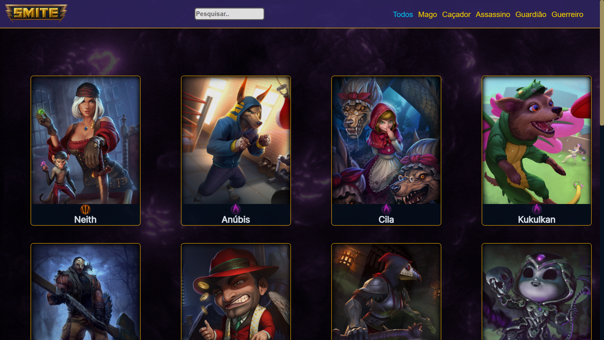
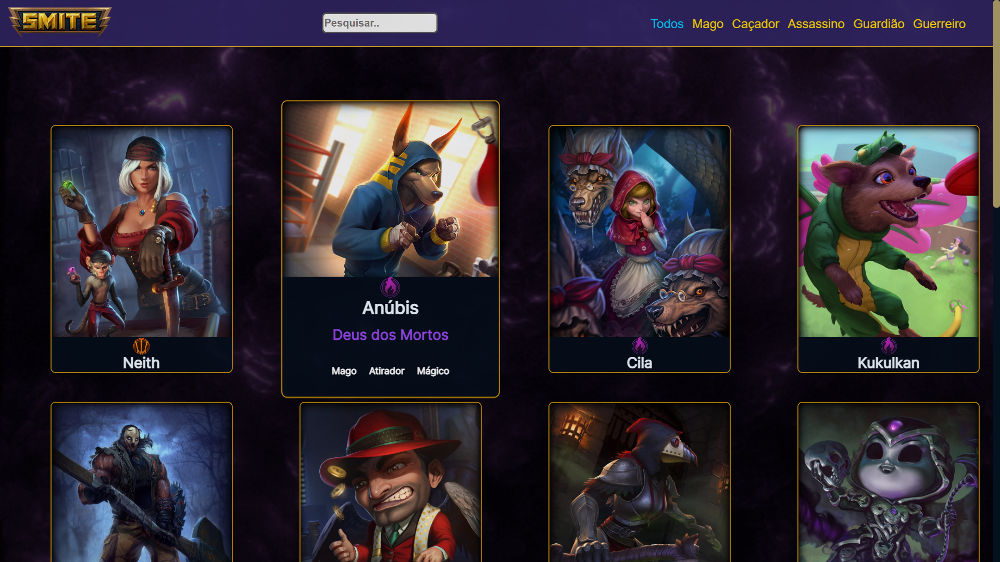
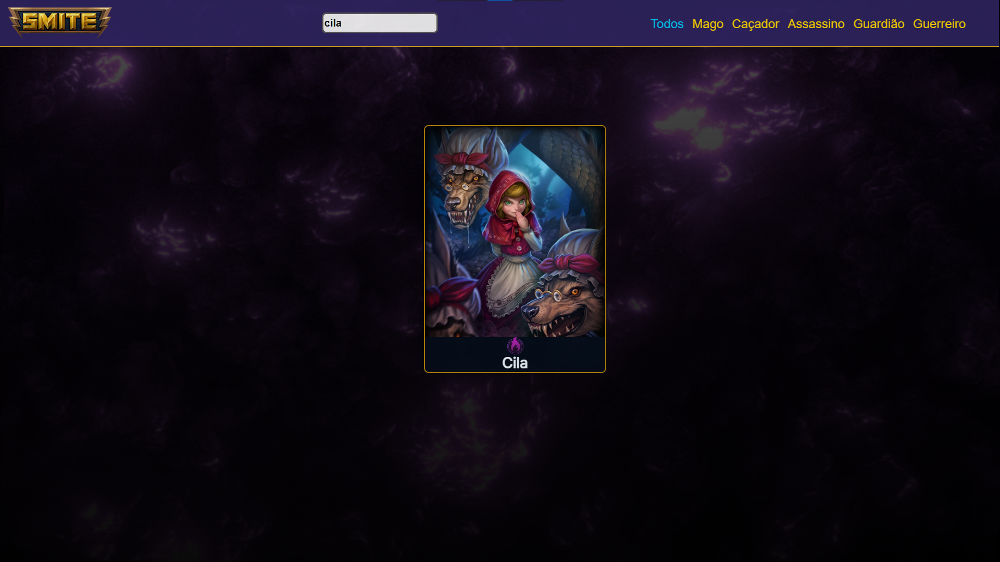
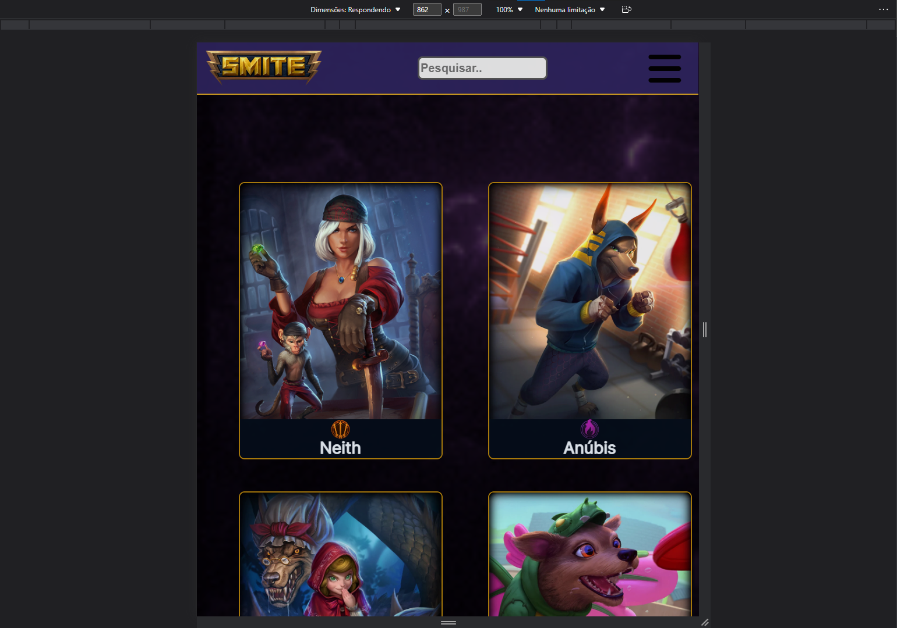
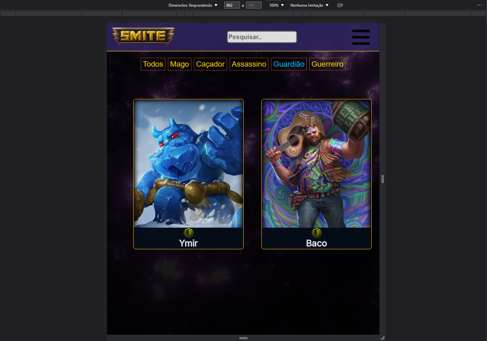

    

## Índice

1. [Sobre](#Sobre)
2. [Objetivo](#Objetivo)
3. [Tecnologias e ferramentas](#Tecnologias-e-ferramentas)
4. [Projeto](#Projeto)
5. [Desenvolvimento](#Desenvolvimento)

# Sobre

Alguns de meus personagens favoritos do Smite. Smite é um jogo eletrônico do gênero multiplayer online battle arena em terceira pessoa desenvolvido e publicado por Hi-Rez Studios. 

  

# Objetivo

Projeto desenvolvido para fins de aprendizagem de HTML, CSS e Javascript, colocando em prática os ensinamentos do curso de fullstack da Kenzie Academy Brasil.

  

# Tecnologias e ferramentas

Este projeto foi desenvolvido com HTML, CSS e Javascript.

  

# Projeto

Estas são algumas demonstrações do projeto Smite Gods:

<h2 align="center">Tela cheia</h2>

  

<h2 align="center">Mouse no Anúbis</h2>

  

<h2 align="center">pesquisa "cila"</h2>

  

<h2 align="center">Responsivo</h2>

  

<h2 align="center">Responsivo selecionado Guardião</h2>

  

# Desenvolvimento

Este projeto foi desenvolvido por:

## Melquisedeque Paidosz - Aluno na Kenzie Academy Brasil

[LinkedIn](https://www.linkedin.com/in/melquisedeque-paidosz-da-silva/)

[Github](https://github.com/wikeed)

  

